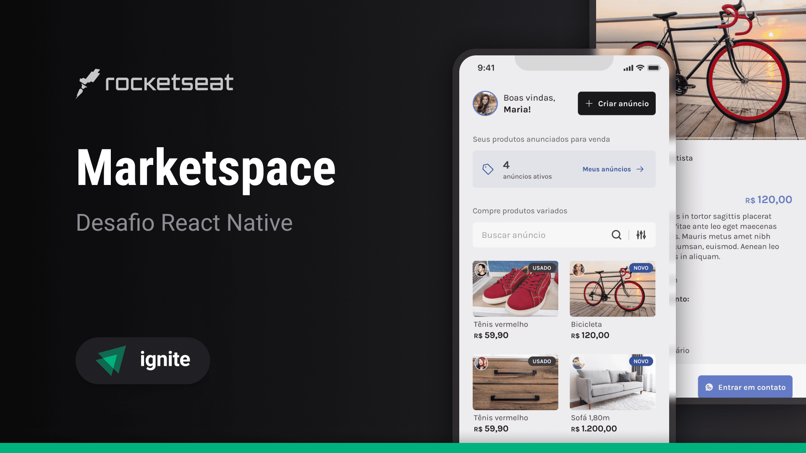

# Marketspace



## Sobre o projeto


Marketspace é um aplicativo onde os usuários cadastrados podem vender ou comprar produtos usados ou novos de outros usuários.

## 🛠 Tecnologias

As seguintes ferramentas foram usadas na construção do projeto:

- [Expo](https://expo.io/)
- [React Native](https://reactnative.dev/)
- [Native Base](https://nativebase.dev/)
- [TypeScript](https://www.typescriptlang.org/)


## Features

- [x] Cadastro de usuários
- [x] Sistema de login
- [x] Cadastro de produtos
- [x] Atualização de produtos
- [x] Exclusão de produtos
- [x] Sistema de contatar o vendedor

## Pré-requisitos

Antes de começar, você vai precisar ter instalado em sua máquina as seguintes ferramentas:
[Git](https://git-scm.com), [Node.js e npm](https://nodejs.org/en/).

Além disto é bom ter um editor para trabalhar com o código como [VSCode](https://code.visualstudio.com/), e um emulador ou aparelho com o Expo Go instalado.

### Rodando o Back End (servidor)

```bash
# Clone este repositório
$ git clone <https://github.com/gustavosorati/marketspace>

# Acesse a pasta do projeto no terminal/cmd
$ cd backend

# Vá para a pasta server
$ npm install

# Instale as dependências
$ npx prisma generate dev

$ npx prisma db seed

# Execute a aplicação em modo de desenvolvimento
$ npm run dev

# O servidor inciará na porta:3333 - acesse <http://localhost:3333>
```

### Executando o aplicativo

```bash
# Clone este repositório
$ git clone <https://github.com/gustavosorati/marketspace>

# Acesse a pasta do projeto no terminal/cmd
$ cd mobile

# Vá para a pasta server
$ npm install

# Instale as dependências
$ npx expo start
```